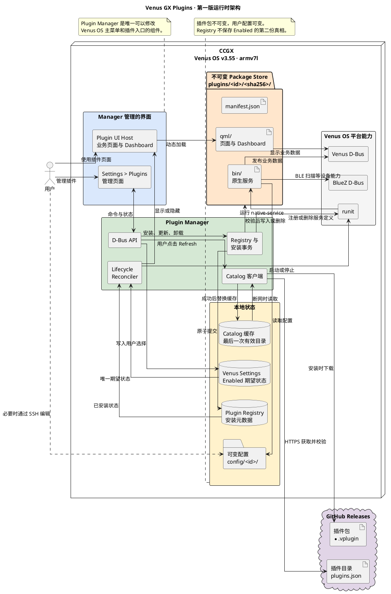

# Venus GX Plugins 架构

这是第一版目标架构。Plugin Manager 是 Venus OS 与插件之间唯一的管理边界。

## 架构边界

- Plugin Manager 是唯一可以修改 Venus OS 主菜单和插件入口的组件。
- `/Settings/Plugins/<plugin-id>/Enabled` 是启用状态的唯一真相来源。
- Registry 只记录版本、路径和 SHA-256 等安装元数据。
- 插件包不可变，用户配置独立保存；升级插件不能覆盖配置。
- 关闭插件会停止服务并隐藏业务界面，但保留配置和重新启用入口。
- Plugin Manager 安装程序只安装管理平台，不捆绑任何插件运行文件。
- 插件不能携带安装脚本、远程 shell hook 或 Python 运行环境。

## 当前实现状态

目前已经完成 Manifest、Catalog、本地 Registry 和安装事务。Registry 中的 `enabled` 字段是 Venus Settings 接入前的临时状态；实现 D-Bus 和 Lifecycle Reconciler 时应移除，避免长期保留两个状态来源。

D-Bus 服务、Lifecycle Reconciler、runit、Venus Settings 和动态 QML Host 尚未接通。
