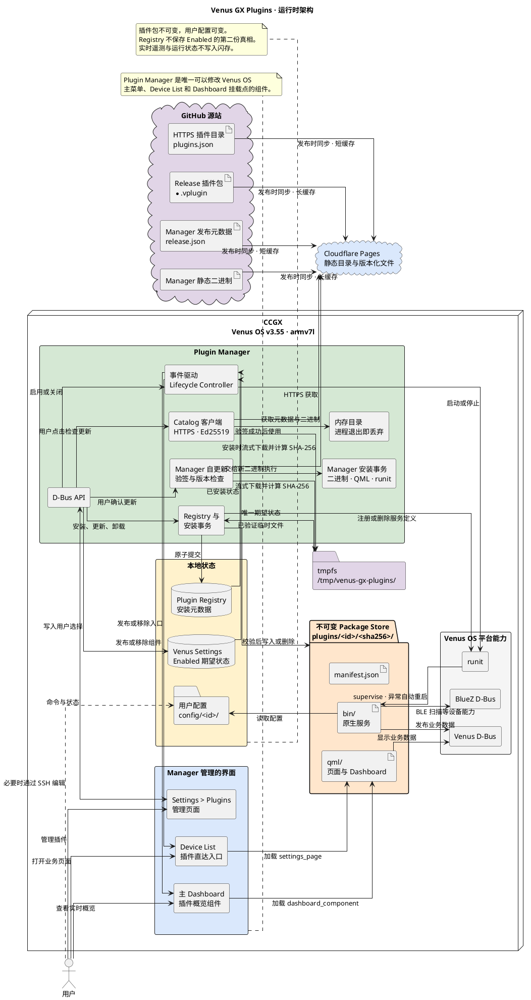

# Venus GX Plugins 架构

Plugin Manager 是 Venus OS 与插件之间唯一的管理边界。

## 架构边界

- Plugin Manager 是唯一可以修改 Venus OS 主菜单和插件入口的组件。
- `/Settings/Plugins/<plugin-id>/Enabled` 是启用状态的唯一真相来源。
- Registry 只记录版本、路径和 SHA-256 等安装元数据。
- 插件包不可变，用户配置独立保存；升级插件不能覆盖配置。
- 关闭插件会停止服务并隐藏业务界面，但保留配置和重新启用入口。
- 普通卸载保留 Manager 管理的 `config/<plugin-id>/`；彻底卸载经二次确认后只删除该插件的配置目录。
- Plugin Manager 安装程序只安装管理平台，不捆绑任何插件运行文件。
- 插件不能携带安装脚本、远程 shell hook 或 Python 运行环境。

## 生命周期契约

生命周期控制只组合三类独立事实：Registry 提供“是否已安装”，Venus Settings 提供“是否应启用”，平台适配器提供服务和界面的实际状态。控制器自身不保存第四份状态。

控制只发生在 Manager 启动和用户发出安装、启用、关闭或卸载命令时。对 `native-service`，启用时先启动服务再显示界面，关闭时先隐藏界面再停止服务；对 `qml-only`，不会生成服务动作。状态已经一致时不产生动作。服务启动后由 runit supervise，进程异常退出由 runit 自动重启，Manager 不承担看门狗职责。

## 事件驱动运行时

Plugin Manager 作为常驻但事件驱动的 Venus D-Bus 控制面：启动时完成一次状态初始化，随后阻塞等待用户命令，不进行周期轮询。Manager 在 `PageMain.qml` 中只保留一个通用 Device List 模型挂载点，在 `main.qml` 中只保留一个通用 Dashboard 控制器；插件的 Settings 页面和 Dashboard 组件均从不可变 Package Store 动态加载，Device List 最多四个摘要值也只按 manifest 声明的 D-Bus 路径读取，不允许插件自行修改系统 QML。

CCGX 只访问固定的 Cloudflare Pages 下载域名。GitHub Release 发布后，自动化会把目录和版本化文件同步为 Pages 静态资产；设备请求不再实时回源 GitHub。目录只接受 HTTPS，用户点击检查更新时严格校验 schema、URL、SHA-256 格式和 Ed25519 签名，成功后只保存在 Manager 内存中。安装包下载后还会重新校验大小、SHA-256、manifest 和归档内容，Cloudflare 不成为新的信任来源。

插件包和 Manager 更新文件流式下载到 tmpfs，并在写入过程中计算 SHA-256。插件包先在 tmpfs 完成身份、结构和解压上限校验；失败时不会触碰 `/data`。通过后才解压到 `/data` 内与 Package Store 同文件系统的事务 staging，再通过原子 rename 提交，避免跨文件系统 rename，也避免把压缩包复制到闪存。

Plugin Manager 自身使用静态 ARMv7 二进制安装。Manager 更新元数据与插件 Catalog 分离，更新文件同样经过 Ed25519 和 SHA-256 校验，再交给内置安装事务更新二进制、QML 与服务定义。GUI 重启后必须由主 QML 页面通过 D-Bus 回报就绪；Manager、GUI 进程或该语义握手任一失败，安装事务都会恢复原文件与服务状态。
