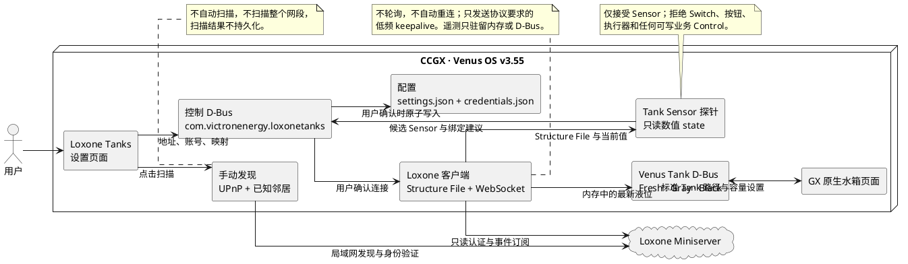

# Loxone Tanks 设计

## 用户流程

1. 用户手动点击扫描，或直接填写 Miniserver 的 IP、主机名或 `.local` 地址。
2. 扫描结果和手动地址都写入同一个内存草稿 `host`。
3. 用户输入 Loxone 只读账号与密码，点击保存并连接。
4. 插件通过 Loxone Structure File 自动探测预设名称：`fw tank`、`gw tank`、`bw tank`。
5. 名称命中后还必须验证它是只读数值型 Sensor state；三者都唯一匹配才保存三个 state UUID 和可撤销令牌。
6. 未预设的 Sensor、Switch、按钮、执行器和其他可写 Control 不显示，插件也不向 Loxone 发送任何业务控制命令。新增识别规则必须随插件版本发布。
7. 插件通过一条 WebSocket 订阅接收三个已绑定 state 的状态事件，并发布三个 Venus 标准 Tank D-Bus 服务。

## 运行时架构



## 配置模型

普通配置保存在：

```text
/data/venus-gx-plugins/config/loxone-tanks/settings.json
```

只包含需要跨重启保留的内容：

- Miniserver 地址
- 只读用户名
- 三个水箱的 Loxone state UUID
- 用户在 GX 原生水箱页面确认的三个水箱容量

密码只作为认证输入，不写入普通配置。正式认证完成后保存可撤销的 Loxone 访问令牌，文件权限为 `0600`。

实时液位、连接状态、扫描结果、Structure File、最后更新时间和普通日志不允许进入配置文件。

启用设置使用合法的 D-Bus 对象路径：

```text
/Settings/Plugins/loxone_tanks/Enabled
```

插件 ID 保持 `loxone-tanks`；设置路径中的连字符按平台规则转换为下划线。

## 功能边界

本插件只解决 Loxone 水箱 Sensor 到 Venus Tank D-Bus 的映射，不作为通用 Loxone 接入平台。当前只支持：

- 清水 Sensor
- 灰水 Sensor
- 黑水 Sensor

传感器探针只接收能产生数值 state 的只读对象，并使用插件版本内置的名称规则。当前固定映射为：

| Loxone Sensor | Venus 水箱 |
| --- | --- |
| `fw tank` | 清水 |
| `gw tank` | 灰水 |
| `bw tank` | 黑水 |

匹配时忽略名称首尾空格和 ASCII 大小写，但不做模糊搜索。未命中的 Loxone 对象不会出现在界面中。候选项在内存中包含名称、Control UUID、state UUID 和显示格式；持久配置只保存用户确认后的 state UUID 与容量。

名称匹配只用于发现，保存后的 state UUID 才是数据身份。三个名称都必须各自唯一匹配；缺少或出现多个同名 Sensor 时不保存配置，并要求用户先在 Loxone 中修正。

## D-Bus 边界

插件控制面使用：

```text
com.victronenergy.loxonetanks
```

水箱数据使用 Venus 原生服务：

```text
com.victronenergy.tank.loxone_fresh
com.victronenergy.tank.loxone_gray
com.victronenergy.tank.loxone_black
```

每个水箱至少发布 `/FluidType`、`/Level`、`/Capacity`、`/Remaining`、`/Connected`、`/DeviceInstance` 和标准管理字段。清水、灰水、黑水的 `/FluidType` 分别为 `1`、`2`、`5`。`/Capacity` 与 `/Remaining` 遵循 Venus 的立方米单位；容量只允许通过 GX 原生水箱设置页修改，确认后换算为升并在值变化时原子保存一次。

插件不提供自定义 Dashboard 组件，也不向设备列表注入额外的插件汇总行。Venus OS v3.55 的原生界面会自动发现 `com.victronenergy.tank.*` 服务并显示三个水箱。

## 双语

Manifest schema 当前只有一个描述字段，因此默认使用中文。QML 读取：

```text
com.victronenergy.settings/Settings/Gui/Language
```

值为 `zh` 时显示中文，否则显示英文。业务数据和 D-Bus 状态使用稳定的英文键，界面负责翻译，不让语言进入持久状态。
