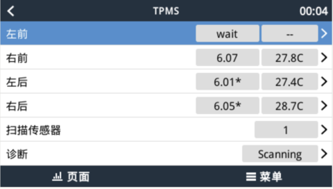

# TPMS

在 CCGX 上显示 BLE 胎压传感器数据。主 Dashboard 可直接查看四轮胎压，设备列表中的 `TPMS` 页面用于扫描传感器并绑定左前、右前、左后、右后四个轮位。

## Dashboard

## TPMS 页面

## 使用

1. 在 `Settings > Plugins` 中安装并启用 TPMS。
2. 从设备列表打开 `TPMS`。
3. 等待扫描到传感器，然后将其绑定到对应轮位。
